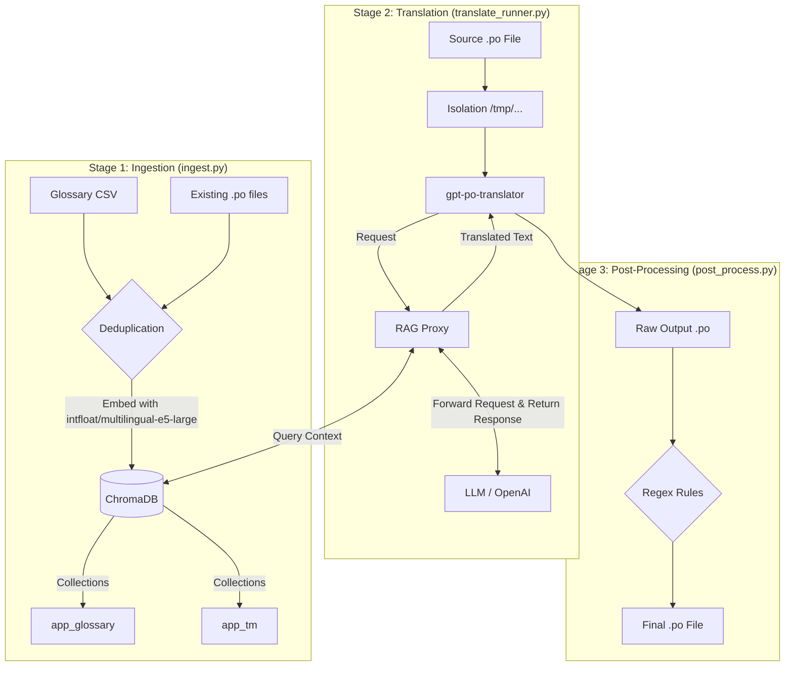

# Architecture & RAG Workflow

This document explains how the Translation Toolbox processes data. It uses a Retrieval-Augmented Generation (RAG) pipeline to ensure translations are consistent with project-specific terminology and previous translation memory (TM).

The system processes data through three main stages: **Ingestion**, **Translation**, and **Post-Processing**.

## System Architecture

This section describes the technical components and infrastructure supporting the pipeline.

### The Vector Store (ChromaDB)
The core of the system is **ChromaDB**, a vector database that stores semantic representations of the glossary and translation memory.

* **Embedding Model**: Uses `intfloat/multilingual-e5-large`, which is specifically optimised for multilingual retrieval across different language pairs.
* **Distance Metric**: Configured to use **Cosine Similarity** to determine the mathematical closeness of strings.
* **Data Formatting**: The E5 model family requires specific prefixes to function correctly. During storage, the system automatically prepends the prefix `passage:` to all records to signify they are retrievable data points.

### The RAG Proxy
The **RAG Proxy** acts as an intermediary between the translation tool and the LLM (OpenAI).
* **Purpose**: While the `gpt-po-translator` tool is excellent for robustly handling `.po` files, it lacks native support for external glossaries. The proxy solves this by intercepting translation requests (defaulting to `http://rag-proxy:5000/v1`) and augmenting them with context from the vector store.
* **Token Optimisation**: By dynamically retrieving only the most relevant matches for a specific string, the proxy avoids sending an entire static glossary with every request, significantly reducing API costs and latency.

---

## Processing Workflow

The following diagram outlines the data lifecycle:
(Copy & paste the following code into https://mermaid.live to view the diagram)

### Stage 1: Ingestion
The `ingest.py` script populates the vector store with two types of reference data:
1. **Glossary (`app_glossary`)**: Imports terms from a single CSV file found in `data/tm_source`. It performs whitespace cleaning and deduplicates entries based on the source text to ensure a clean reference set.
2. **Translation Memory (`app_tm`)**: Extracts `msgid` (source) and `msgstr` (target) pairs from existing `.po` files found in `data/tm_source`. It explicitly excludes "fuzzy" matches to prevent low-quality or draft translations from polluting the database.

### Stage 2: Translation
The `translate_runner.py` script manages the core translation logic:
1. **File Isolation**: To prevent accidental modification of source data, the script copies the target `.po` file to a randomised temporary directory for processing.
2. **RAG Augmentation**: The script routes requests through the **RAG Proxy**, which performs a semantic query against ChromaDB. It retrieves glossary terms and past translations that are most similar to the current string and includes them in the LLM prompt.
3. **Output Generation**: Translated files are saved to `data/translations/output`.
    * **Caution**: This output directory is wiped and refreshed every time `translate.sh` is executed.

### Stage 3: post-processing (optional)
If you have enabled the post-processing option in the .env file, the selected post-processing plugins will run after the completion of the translation. See [Post-Processing Framework](2_post_processing.md) for more information.
