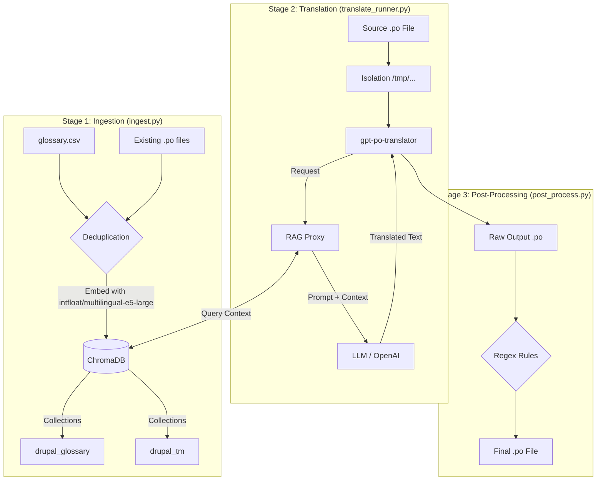

# Architecture & RAG Workflow

This document explains how the Translation Toolbox processes data. It uses a Retrieval-Augmented Generation (RAG) pipeline to ensure translations are consistent with Drupal terminology and previous translation memory (TM).

Many thanks to @matthews (www.drupal.org/u/matthews) for recommending the RAG approach! (And yes, it was a bit of a rabbit hole!)

The system consists of three main stages: **Ingestion**, **Translation**, and **Post-Processing**.

(Copy & paste the following into https://mermaid.live to view the diagram)

```mermaid
flowchart TD
    subgraph Ingestion ["Stage 1: Ingestion (ingest.py)"]
        A[glossary.csv] --> C{Deduplication}
        B[Existing .po files] --> C
        C -->|Embed with intfloat/multilingual-e5-large| D[(ChromaDB)]
        D -- Collections --> E[drupal_glossary] & F[drupal_tm]
    end

    subgraph Translation ["Stage 2: Translation (translate_runner.py)"]
        G[Source .po File] --> H[Isolation /tmp/...]
        H --> I[gpt-po-translator]
        I -->|Request| J[RAG Proxy]
        J <-->|Query Context| D
        J -->|Prompt + Context| K[LLM / OpenAI]
        K -->|Translated Text| I
    end

    subgraph PostProcess ["Stage 3: Post-Processing (post_process.py)"]
        I --> L[Raw Output .po]
        L --> M{Regex Rules}
        M --> N[Final .po File]
    end
```

## 1. The Vector Store (ChromaDB)
The core of this system is **ChromaDB**, which stores vector representations of the glossary and translation memory.

* **Embedding Model:** The model `intfloat/multilingual-e5-large` is used. This model is optimised for multilingual retrieval.
* **Distance Metric:** The database is configured to use **Cosine Similarity** to find the closest matches.
* **Data Formatting:** The embedding model requires specific prefixes. During ingestion, the system automatically adds the prefix `passage:` to all data stored in the database.

## 2. Stage 1: Ingestion
The script `ingest.py` populates the database. It handles two types of data:

1.  **Glossary (`drupal_glossary`):** Reads from `glossary.csv`. It cleans whitespace and deduplicates entries based on the source text.
2.  **Translation Memory (`drupal_tm`):** Scans all `.po` files in the source directory. It extracts `msgid` (source) and `msgstr` (target), ensuring that fuzzy matches (draft translations) are excluded to maintain quality.

## 3. Stage 2: Translation Process
The script `translate_runner.py` manages the translation workflow. It orchestrates the `gpt-po-translator` tool to process files securely and efficiently.

### Why a RAG Proxy is used
`gpt-po-translator` was selected for this PoC for this project because it provides robust handling of `.po` files and useful features such as bulk processing. However, this tool has one major limitation: it does not natively support external glossaries or translation memory.

This is the reason **RAG Proxy** was built. The `translate_runner.py` script routes all requests to this proxy (`http://rag-proxy:5000/v1`) instead of connecting directly to the OpenAI API.

**The Proxy Workflow:**
1.  **Query:** When the proxy receives a string to translate, it queries the ChromaDB vector database.
2.  **Retrieval:** It identifies glossary terms and previous translations from the Translation Memory that are **semantically close** to the input string.
3.  **Augmentation:** These retrieved strings are sent to the LLM alongside the untranslated text.

This approach ensures the LLM has the necessary context to maintain consistency with Drupal terminology and high translation quality, while still leveraging the efficient file processing of `gpt-po-translator`.

**Key Benefit: Token Optimization**
By retrieving only the most relevant matches for batched strings, the proxy significantly reduces the number of tokens handled per request. This avoids the need to send a massive, static glossary or translation memory with every API call, improving both speed and cost-efficiency.

### File Isolation
To ensure the translator focuses strictly on one file at a time, the runner script isolates files during processing. It copies the target `.po` file to a temporary directory (`/tmp/temp_work_dir`) before the translation command runs. This prevents the tool from scanning or modifying unrelated files in the source directory.

After the translation is complete, the file is saved in `data/translations/output`.

**Caution**
The content of `data/translations/output` is wiped every time you run `bash bin/translate.sh`.

To ensure the translator focuses strictly on one file at a time, the runner script isolates files during processing. It copies the target `.po` file to a temporary directory (`/tmp/temp_work_dir`) before the translation command runs. This prevents the tool from scanning or modifying unrelated files in the source directory.

## 4. Stage 3: Post-Processing
After translation, the output often requires formatting fixes to meet Drupal coding standards. The `post_process.py` script applies regular expressions (Regex) to fix whitespace around variables.

**Example Fixes:**
* **Input:** `こんにちは%userさん` (Variable glued to text)
* **Output:** `こんにちは %user さん` (Correct spacing added)

This ensures that Drupal variables (starting with `!`, `@`, or `%`) are correctly recognised by the Drupal system.
